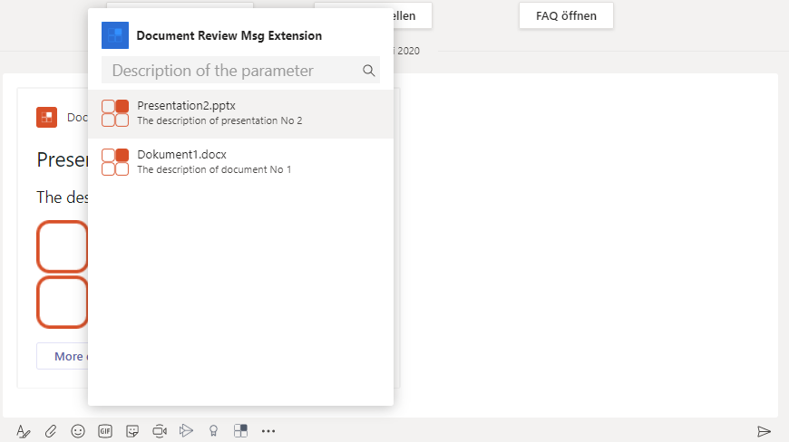
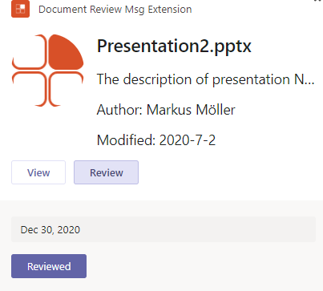

# Document Review Search Messaging Extension

## Summary

This sample is a search based messaging extension created using the Teams Yeoman Generator as featured in [this video](https://www.youtube.com/watch?v=S1eANUbqaRs&list=PLR9nK3mnD-OUeDoawdmYJJsTlRHd6p5DB&index=7&t=7s). It authenticates against Microsoft Graph and recieves doduments due for review.



... and an adaptive card with document details is inserted into the conversation

and the review can be directly confirmed as an action from within the card

For further details see the [Yo Teams wiki for the project structure](https://github.com/PnP/generator-teams/wiki/Project-Structure)
The example is documented in
- The author's [blog series](https://mmsharepoint.wordpress.com/2020/07/03/a-microsoft-teams-messaging-extension-with-authentication-and-access-to-microsoft-graph-i/)
- A PnP [community demo](https://www.youtube.com/watch?v=bRRkblD0vTI)

## Frameworks


## Prerequisites

* [Office 365 tenant](https://dev.office.com/sharepoint/docs/spfx/set-up-your-development-environment)
* [Node.js](https://nodejs.org) version 10.14.1 or higher
* [ngrok](https://ngrok.com) or similar tunneling application is required for local testing

    ```bash
    # determine node version
    node --version
    ```


## Version history

Version|Date|Author|Comments
-------|----|----|--------
1.0|August 26, 2020|Markus Moeller|Initial release

## Disclaimer

**THIS CODE IS PROVIDED *AS IS* WITHOUT WARRANTY OF ANY KIND, EITHER EXPRESS OR IMPLIED, INCLUDING ANY IMPLIED WARRANTIES OF FITNESS FOR A PARTICULAR PURPOSE, MERCHANTABILITY, OR NON-INFRINGEMENT.**

---

## Minimal Path to Awesome
- Clone the repository

    ```bash
    git clone https://github.com/PnP/teams-dev-samples.git
    ```

- In a console, navigate to `samples/msgext-customer-search`

    ```bash
    cd samples/msgext-customer-search
    ```

- Install modules

    ```bash
    npm install
    ```

- Run ngrok - point to port 3978

    ```bash
    ngrok http -host-header=rewrite 3978
    ```

- Since messaging extensions utilize the Azure Bot Framework, you will need to register a new bot. 
[These instructions](https://docs.microsoft.com/en-us/microsoftteams/platform/bots/how-to/create-a-bot-for-teams#register-your-web-service-with-the-bot-framework) provide options for registering with or without an Azure subscription. 
  - Be sure to enable the Microsoft Teams bot channel so your solution can communicate with Microsoft Teams
  - For local testing, set the messaging endpoint to the https URL returned by ngrok plus "/api/messages"
  - Note the bot's Application ID and password (also called the Client Secret) assigned to your bot during the registration process. In the Azure portal this is under the Bot Registration settings; in the legacy portal it's in the Settings tab. Click Manage to go to Azure AD to obtain the Client Secret. You may need to create a new Application Secret in order to have an opportunity to copy it out of the Azure portal. 
- You will furthermore need to register an app in Azure AD [also describe here](https://mmsharepoint.wordpress.com/2020/07/03/a-microsoft-teams-messaging-extension-with-authentication-and-access-to-microsoft-graph-i/)
  - with client secret
  - with web redirect Uri https://token.botframework.com/.auth/web/redirect
  - with **delegated** permissions email, offline_access, openid, profile, Sites.ReadWrite.All
- Update the `.env` configuration for the bot to use the Microsoft App Id and App Password (aka Client Secret) from the previous step. Also add a vlaue ConnectionName=CustomGraphConnection
- In the Bot itself add the app id and secret as "CustomGraphConnection" with app id, tenant id, secret and scope=https://graph.microsoft.com/.default

- Deploy columns and content type to a SharePoint site of your choice. Use [PnP Provisioning Template](templates/DocReview.xml) and Apply-PnPProvisioningTemplate for this.
- Via Graph Explorer retrieve and not down the ID of the chosen site and corresponding documents library. Ref [here](https://mmsharepoint.wordpress.com/2020/07/03/a-microsoft-teams-messaging-extension-with-authentication-and-access-to-microsoft-graph-i-i/) for instructions.

- Generate and upload the application package
  ```bash
  gulp manifest
  ```
  Upload the resulting zip file into Teams [using these instructions](https://docs.microsoft.com/en-us/microsoftteams/platform/concepts/deploy-and-publish/apps-upload).

- Run the bot locally
    ```bash
    gulp serve
    ```

- Test in Microsoft Teams by clicking the ... beneath the compose box in a Team where the application has been installed.

## Features

This is a simple Search messaging extension created with the yeoman teams generator.

## Debug and test locally

To debug and test the solution locally you use the `serve` Gulp task. This will first build the app and then start a local web server on port 3007, where you can test your Tabs, Bots or other extensions. Also this command will rebuild the App if you change any file in the `/src` directory.

``` bash
gulp serve
```

To debug the code you can append the argument `debug` to the `serve` command as follows. This allows you to step through your code using your preferred code editor.

``` bash
gulp serve --debug
```

To step through code in Visual Studio Code you need to add the following snippet in the `./.vscode/launch.json` file. Once done, you can easily attach to the node process after running the `gulp server --debug` command.

``` json
{
    "type": "node",
    "request": "attach",
    "name": "Attach Node",
    "port": 9229,
    "sourceMaps": true,
    "outFiles": [
        "${workspaceRoot}/dist/**/*.js"
    ]
},
```

### Using ngrok for local development and hosting

In order to make development locally a great experience it is recommended to use [ngrok](https://ngrok.io), which allows you to publish the localhost on a public DNS, so that you can consume the bot and the other resources in Microsoft Teams. 

To use ngrok, it is recommended to use the `gulp ngrok-serve` command, which will read your ngrok settings from the `.env` file and automatically create a correct manifest file and finally start a local development server using the ngrok settings.

For an even better expereince you can
- Fire up **two** command prompts
- Both switch to local directory of your solution
- In one call gulp start-ngrok
- In the other only run gulp serve --debug
  - This one you can now start and stop as often as you want without losing your temp. Url
- [Further details on this](https://mmsharepoint.wordpress.com/2020/06/27/microsoft-teams-app-yeoman-generator-split-ngrok-serve/)

### Additional build options

You can use the following flags for the `serve`, `ngrok-serve` and build commands:

* `--no-linting` - skips the linting of Typescript during build to improve build times
* `--debug` - builds in debug mode

## Deploying to Azure using Git

If you want to deploy to Azure using Git follow these steps.

This will automatically deploy your files to Azure, download the npm pacakges, build the solution and start the web server using Express.

1. Log into [the Azure Portal](https://portal.azure.com)
2. Create a new *Resource Group* or use an existing one
3. Create a new *Web App* with Windows App Service Plan and give it the name of your tab, the same you used when asked for URL in the Yeoman generator. In your case https://yourdomainhere.ngrok.io.
4. Add the following keys in the *Configuration* -> *Application Settings*; Name = `WEBSITE_NODE_DEFAULT_VERSION`, Value = `8.10.0` and Name = `SCM_COMMAND_IDLE_TIMEOUT`,  Value = `1800`. Click Save.
5. Go to *Deployment Center*
6. Choose *Local Git* as source and *App Service build service* as the Build Provider 
7. Click on *Deployment Credentials* and store the App Credentials securely
8. In your tab folder initialize a Git repository using `git init`
9. Build the solution using `gulp build` to make sure you don't have any errors
10. Commit all your files using `git add -A && git commit -m "Initial commit"`
11. Run the following command to set up the remote repository: `git remote add azure https://<username>@[your Azure web app name].scm.azurewebsites.net:443/[your Azure web app name].git`. You need to replace <username> with the username of the App Credentials you retrieved in _Deployment Credentials_. You can also copy the URL from *Options* in the Azure Web App.
12. To push your code use to Azure use the following command: `git push azure master`, you will be asked for your credentials the first time, insert the Password for the App Credential. Note that you should update the Azure Web Site application setting before pushing the code as the settings are needed when building the application.
13. Wait until the deployment is completed and navigate to https://yourdomainhere.ngrok.io/privacy.html to test that the web application is running
14. Done
15. Repeat step 11 for every commit you do and want to deploy

> NOTE: The `.env` file is excluded from source control and will not be pushed to the web site so you need to ensure that all the settings present in the `.env` file are added as application settings to your Azure Web site (except the `PORT` variable which is used for local debugging).

## Logging

To enable logging for the solution you need to add `msteams` to the `DEBUG` environment variable. See the [debug package](https://www.npmjs.com/package/debug) for more information. By default this setting is turned on in the `.env` file.

Example for Windows command line:

``` bash
SET DEBUG=msteams
```

If you are using Microsoft Azure to host your Microsoft Teams app, then you can add `DEBUG` as an Application Setting with the value of `msteams`.

